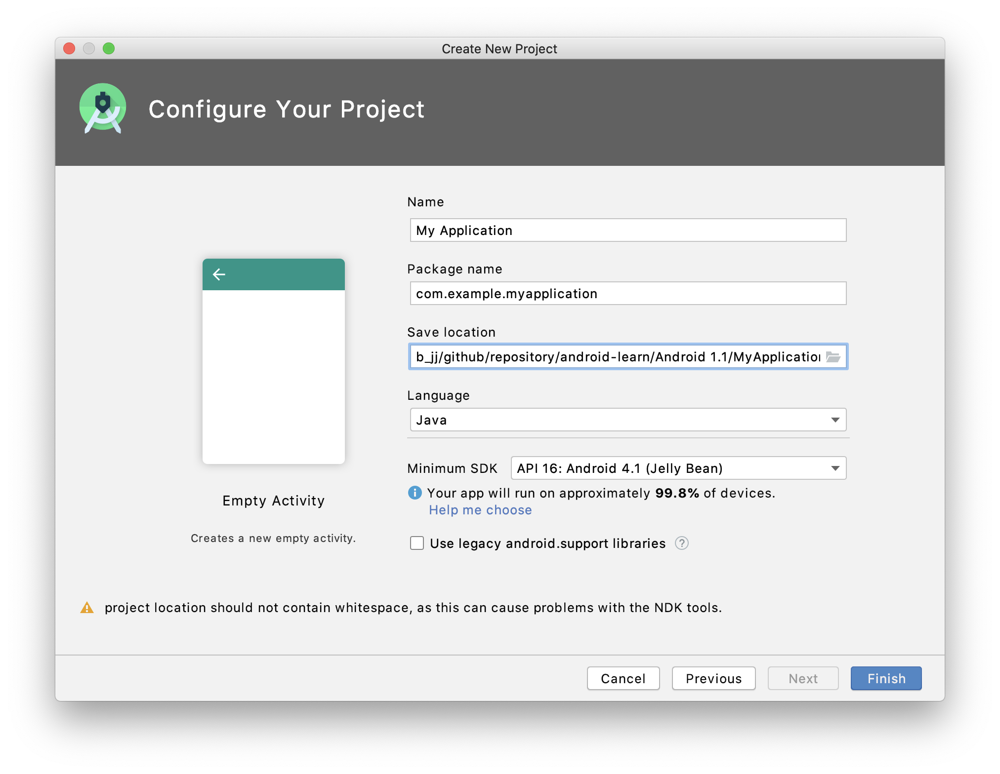
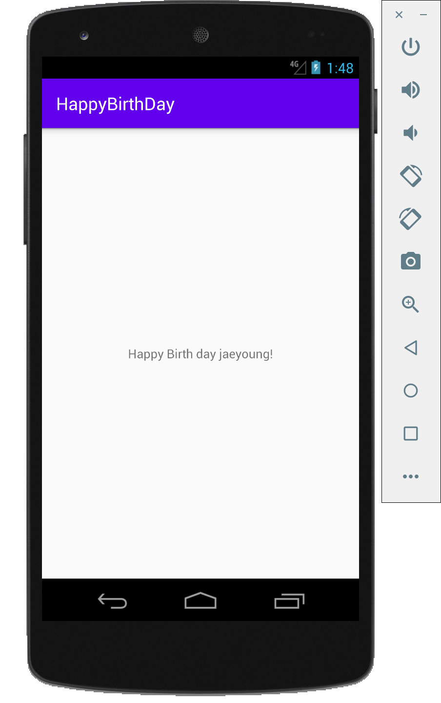

# AndroidStudio

## Study for Android Studio IDE

### 1.1 Android Studio and Hello World

> 1. **Install Android Studio**
>
> 2. **Create Hello World app**
>
>    
>
> 3. **Use a virtual Device**
>
>    * Nexus 5 API 16
>
>     
>
> 4. **Change the app Gradle configuration**
>
>    `build.gradle(Module.app): midSdkVersion 16`
>
> 5. **Add log statements to app**
>
>    * Use `Log.d("MainActivity", "Hello World"); ` 
>
>      in onCreate( ) of MainActivity.java.
>
>    * It display
>
>      `Log.d("MainActivity", "Hello World");` at Logcat.