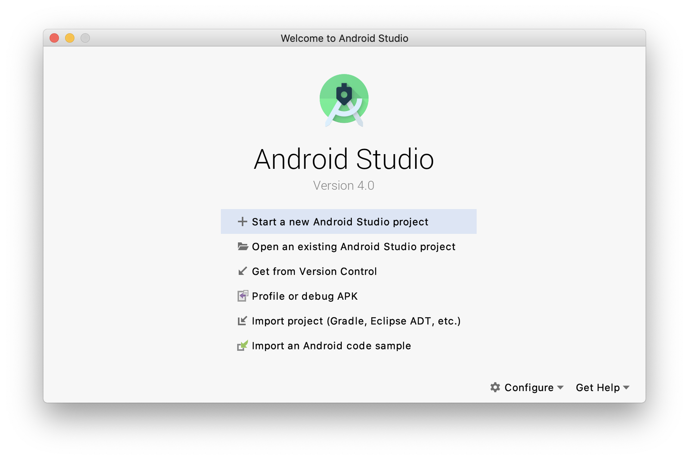
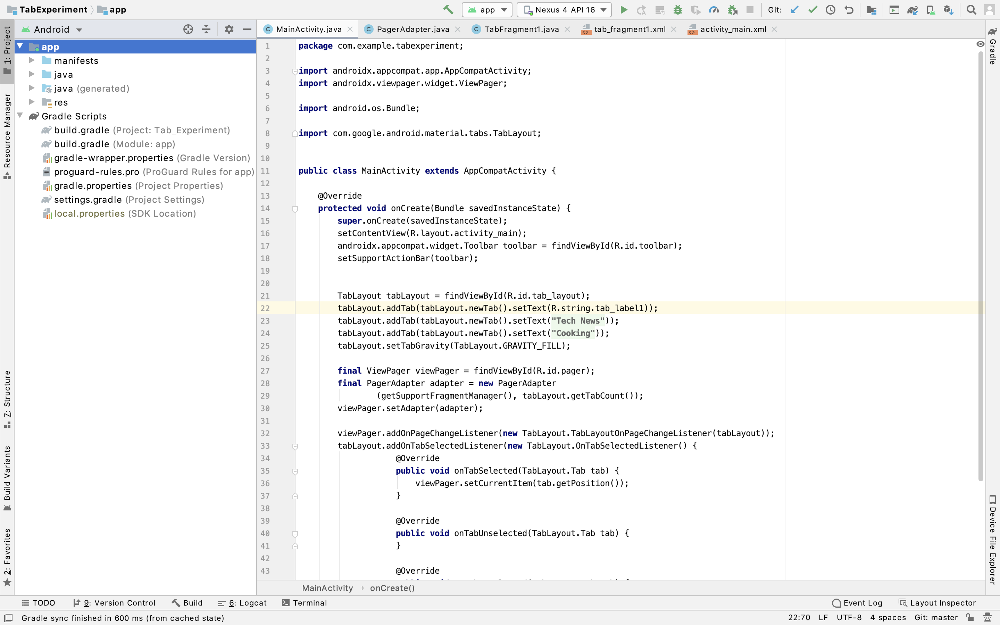
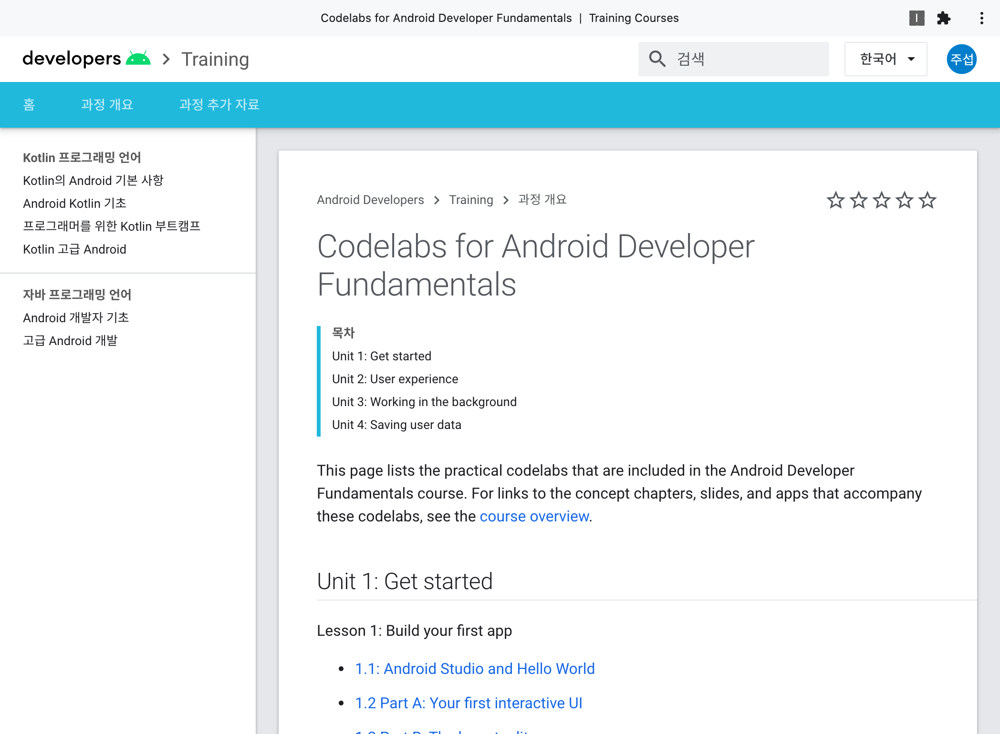

# AndroidStudio
## Study for Android Studio IDE

***

1. Android Studio Start!
> </img>

> </img>

***

2. Using Nexus 4 API 16

> </img>

***

3. Using Android Gradle plugin version. 

> *3.5.3*
> ```
> classpath 'com.android.tools.build:gradle:3.5.3'
> ```

***

4. Reference URL

> ```<http://codelabs.developers.google.com>```
> </img>

***

